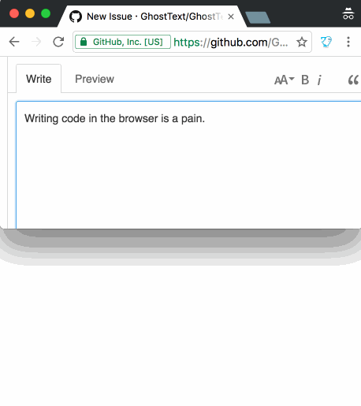

# 

[link-cws]: https://chrome.google.com/webstore/detail/ghosttext/godiecgffnchndlihlpaajjcplehddca 'Version published on Chrome Web Store'
[link-amo]: https://addons.mozilla.org/en-US/firefox/addon/ghosttext/ 'Version published on Mozilla Add-ons'

Use your text editor to write in your browser. Everything you type in the editor will be instantly updated in the browser (and vice versa).

**Notice: GhostText generally works but it has some bugs across the various implementations. If you use it regularly please consider contributing/bugfixing your editor's GhostText plugin.**

## Installation

1. Install your editor extension:

	- [**Sublime Text**](https://sublime.wbond.net/packages/GhostText) ([Repo](https://github.com/GhostText/GhostText-for-SublimeText))
	- [**Atom**](https://github.com/GhostText/GhostText-for-Atom)
	- [**VS Code**](https://marketplace.visualstudio.com/items?itemName=tokoph.ghosttext) ([Repo](https://github.com/jtokoph/ghosttext-vscode)) (Third party)
	- [**Emacs**](https://melpa.org/#/atomic-chrome) ([Repo](https://github.com/alpha22jp/atomic-chrome)) (Third party)
	- [**Acme**](https://github.com/fhs/Ghost) (Third party)
	- 

			
<b>Vim</b>/<b>Neovim</b> (Third party)

			<ul>
				<li><a href="https://github.com/raghur/vim-ghost"><b>Vim</b> (<tt>+python3</tt>) & <b>Neovim</b> (<tt>pynvim</tt>)</a>
				<li><a href="https://github.com/falstro/ghost-text-vim"><b>Vim</b> (<tt>+tcl</tt>)</a>
				<li><a href="https://github.com/pandysong/ghost-text.vim"><b>Vim</b> (<tt>+python3 +channel</tt>)</a>
				<li><a href="https://github.com/subnut/nvim-ghost.nvim"><b>Neovim</b></a>
			</ul>
		

2. Install your browser extension:

	 - [**Chrome**][link-cws] [][link-cws]
	 - [**Firefox**][link-amo] [][link-amo]

## Website support

- `<textarea>` elements
- [`contentEditable`](https://developer.mozilla.org/en-US/docs/Web/Guide/HTML/Content_Editable) areas: like in Gmail
- [CodeMirror](http://codemirror.net/) editors: used on CodePen, JSFiddle, JS Bin, …
- [Ace](http://ace.c9.io/) editor: used on Tumblr, …

## Usage

1. Open your editor
2. Click the **GhostText** button in the browser’s toolbar
3. Click inside the desired field (if there’s more than one)

Notice: in some editors you’ll need to run the _Enable GhostText_ command after step 1. Refer to your editor’s GhostText extension readme. Sublime Text does this automatically.

### Keyboard shortcuts

You can use a keyboard shortcut instead of clicking the button. The shortcut can be changed or disabled,
[like this in Chrome](http://lifehacker.com/add-custom-keyboard-shortcuts-to-chrome-extensions-for-1595322121)
or
[like this in Firefox](https://support.mozilla.org/en-US/kb/manage-extension-shortcuts-firefox).

<table>
	<tr>
		<th>OS</th>
		<th>Shortcut</th>
	</tr>
	<tr>
		<td>Windows</td>
		<td><kbd>ctrl</kbd> + <kbd>shift</kbd> + <kbd>K</kbd></td>
	</tr>
	<tr>
		<td>Linux</td>
		<td><kbd>ctrl</kbd> + <kbd>shift</kbd> + <kbd>H</kbd></td>
	</tr>
	<tr>
		<td>Mac</td>
		<td><kbd>cmd</kbd> + <kbd>shift</kbd> + <kbd>K</kbd></td>
	</tr>
</table>

## License

MIT © [Federico Brigante](https://fregante.com)
